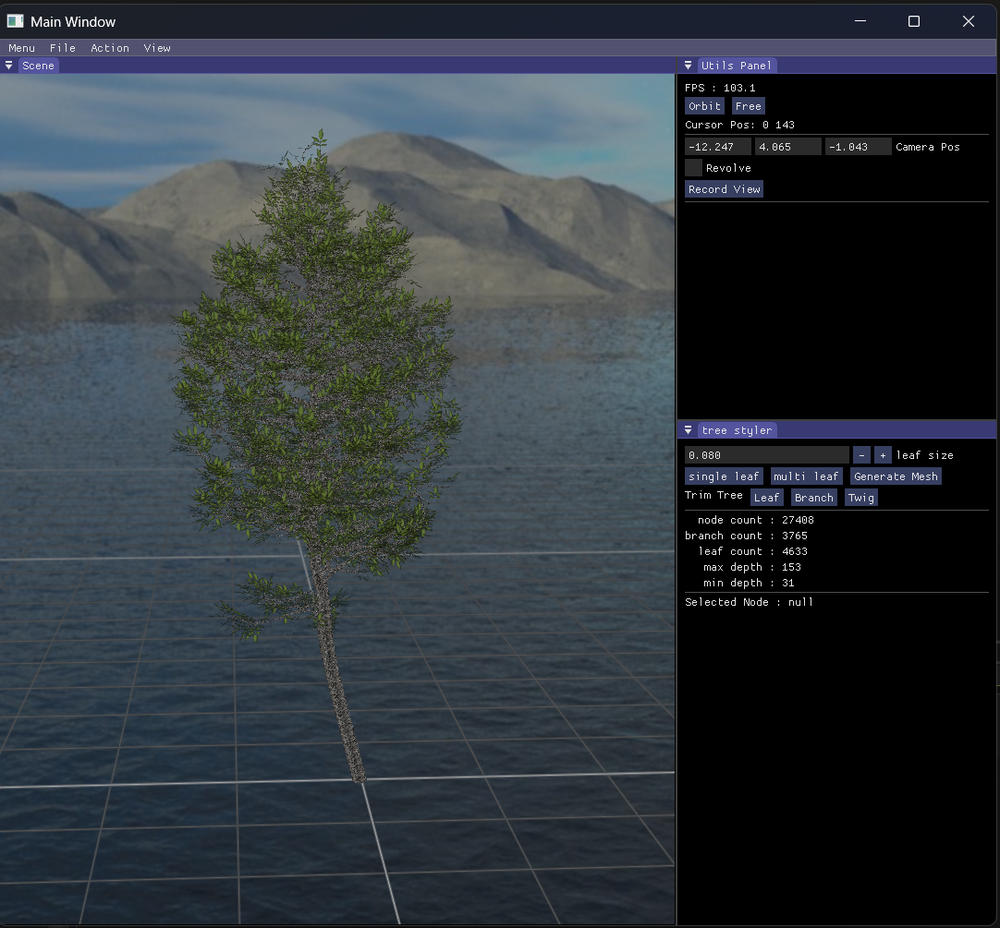

# Retree
**Retree** is an editor for tree reconstruction and visualization. It can automatically or manually trim redundant branches and leaves, customize leaf models and trunk textures, and build meshes with a flexible constructor.  By taking a point cloud as input and leveraging the powerful [AdTree](https://github.com/tudelft3d/AdTree) reconstruction algorithm, generates accurate tree skeletons for further editing and rendering.

1. Users can first capture images of the target tree from multiple angles, then import the photos into **COLMAP** to reconstruct the corresponding 3D point cloud.  
2. After launching the program, load the generated point cloud file (`.ply` or `.xyz`) via the **File** menu. The system will automatically align and center the data in the scene window.  
3. If the input point cloud appears upside down or with incorrect axis orientation, it can be corrected through **Action**.  
4. Once adjustments are complete, select **Action → Run Pipeline** to execute the full tree reconstruction process, including skeleton extraction and mesh construction. The results will be displayed later at the center of the window.  
5. Next, various editing operations (such as trimming, extraction, connection, and subtree manipulation) can be performed in the **Tree Node Editing Panel**. The editing results are rendered instantly in the scene, allowing users to interactively refine the reconstruction as needed.  

## Screenshots

## Instruction

| **Key**              | **Function**                                 |
|-----------------------|-----------------------------------------------|
| W / A / S / D        | Move camera on XZ plane (Free mode)           |
| Space / Left-Shift   | Move camera up / down (Free mode)             |
| Mouse Move           | Rotate camera view (Free mode)                |
| Right Mouse Drag     | Pan camera (Orbit mode)                       |
| Middle Mouse Drag    | Rotate camera view (Orbit mode)               |
| Left Mouse Click     | Select tree node                              |
| Tab                  | Switch camera movement mode                   |
| PrtScr               | Screenshot scene                              |
| R                    | Rotate camera around model                    |
| P                    | Show / Hide tree point cloud                  |
| S                    | Show / Hide tree skeleton                     |
| T                    | Show / Hide tree mesh                         |
| E                    | Enable / Disable wind effect                  |
| X                    | Show / Hide coordinate axes                   |
| G                    | Show / Hide grid                              |
